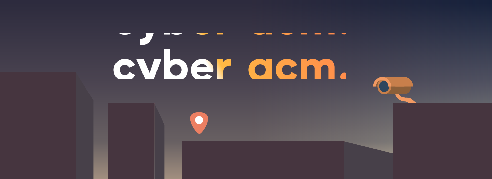

# The ACM Cyber Website

Hi there! This repository holds the code for ACM Cyber @ UCLA's front-facing website, which can be viewed at [cyber.uclaacm.com](https://cyber.uclaacm.com/). You can find out more about ACM Cyber, the events we run, and resources for learning about cybersecurity!

Our website is built with [Next.js](https://nextjs.org/) on top of [React](https://reactjs.org/), with a style and design system developed by our in-house designers and [ACM Design](https://design.uclaacm.com/). We use [ESLINT](https://eslint.org/) to lint our JS code. 

## Table of Contents
- [Notes for Developers](#notes-for-developers)
    - [Development Setup](#development-setup)
    - [Contributing](#contributing)
- [Contact](#contact)
- [Acknowledgements](#acknowledgements)

## Notes for Developers
### Development Setup
We'll follow a very traditional Node.js project setup. Before we start, make sure that you have the LTS version of Node (currently ~ 16.x) and a copy of `git` on your computer. We will use `yarn` to install our dependencies and run the website. 

First, we'll clone the repo and install all of our dependencies. You only need to do this once.
```bash
$ git clone https://github.com/uclaacm/cyber.uclaacm.com.git
...
$ cd cyber.uclaacm.com
$ yarn install
```

We can run the following commands to start the server:
```bash
$ yarn build

> $ next build
> info  - Skipping linting
> info  - Checking validity of types
> Read more: https://nextjs.org/docs/messages/sharp-missing-in-production
> info  - Creating an optimized production build
> info  - Compiled successfully
> info  - Collecting page data
> info  - Generating static pages (7/7)
> info  - Finalizing page optimization

$ yarn start 

> yarn run v1.22.19
> $ next start
> ready - started server on 0.0.0.0:3000, url: http://localhost:3000
```

To run the website in a development environment, run the following command:
```bash
$ yarn run dev

> yarn run v1.22.19
> $ next dev
> ready - started server on 0.0.0.0:3000, url: http://localhost:3000
> event - compiled client and server successfully in 359 ms (198 modules)
```

This should automatically open up a window in your browser with our website; if it doesn't, visit http://localhost:3000.

Note that next dev ships with "Fast Refresh" (their version of hot module reloading), so every time you modify a file, the app will automatically recompile and reload!

### Contributing
1. Before making any changes, run git pull to ensure your local repository is up to date.
2. Make a new branch for your changes. main is a protected branch, so you cannot push to it.
```
    git checkout -b firstName/feature
```

Once you're ready, stage and commit your changes:
```
    git add .
    git commit -m "Description of your changes"
    git push
```
Make a pull request with your changes, and let a project lead know.

If your code passes code review, then we can merge it into main. 

Congratulations! If you'd like, it's now safe to delete your branch.

## Contact
Email: uclacyber@gmail.com

Discord: https://discord.gg/j9dgf2q

## Acknowledgements
Shout out to the ACM Cyber Website Development team for their hard work! 